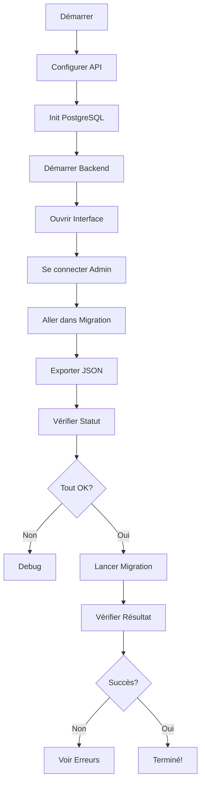

# 🎨 Migration depuis l'Interface d'Admin

## ✅ Configuration en 3 Étapes

### Étape 1 : Configurer les Routes API

**Option A - Automatique (Recommandé)**

```bash
# Exécuter le script de configuration
./scripts/add-migration-routes.sh
```

Le script va :
- ✅ Créer une sauvegarde de `api/server.js`
- ✅ Ajouter automatiquement les routes de migration
- ✅ Vérifier que tout est correct

**Option B - Manuelle**

Si le script ne fonctionne pas, suivez les instructions dans `API_MIGRATION_SETUP.md`

### Étape 2 : Initialiser PostgreSQL

```bash
# Démarrer PostgreSQL
docker-compose up -d postgres

# Initialiser la base de données
cd database
./init-migration.sh
# Choisir : 1) Installation complète
```

### Étape 3 : Redémarrer le Backend

```bash
# Depuis la racine du projet
npm run dev
# ou
pnpm dev
```

---

## 🖥️ Utiliser l'Interface

### 1. Accéder à la Migration

1. Ouvrez votre navigateur : `http://localhost:3000`
2. Connectez-vous en tant qu'admin (admin/admin123)
3. Allez dans **Paramètres**
4. Cliquez sur l'onglet **Migration**

### 2. Vérifier PostgreSQL

Dans la section "État de la Base de Données PostgreSQL" :

1. Cliquez sur **"Vérifier le statut"**
2. Vous devriez voir :
   ```
   Credentials       : 1
   Applications      : 0
   Champs Config     : 0
   Valeurs Config    : 0
   ```

Si vous voyez une erreur :
- Vérifiez que PostgreSQL est démarré
- Vérifiez que le backend est démarré
- Consultez les logs du serveur

### 3. Exporter vos Données (Sauvegarde)

**IMPORTANT** : Faites toujours une sauvegarde avant la migration !

Dans la section "Exporter les Données localStorage" :

1. Cliquez sur **"Exporter en JSON"**
2. Un fichier sera téléchargé : `quality-portal-backup-YYYY-MM-DD.json`
3. Conservez ce fichier en lieu sûr

### 4. Lancer la Migration

Dans la section "Migrer vers PostgreSQL" :

1. Lisez l'avertissement
2. Assurez-vous d'avoir fait la sauvegarde (étape 3)
3. Cliquez sur **"Lancer la Migration"**
4. Attendez quelques secondes

### 5. Vérifier le Résultat

Après la migration, vous verrez :

**✅ Migration réussie**

```
Credentials       : 1
Applications      : 3
Champs Config     : 12
Valeurs Config    : 15
```

Si la migration échoue, vous verrez les erreurs détaillées.

---

## 📊 Interface Complète

### Section 1 : État de la Base de Données

```
┌─────────────────────────────────────┐
│ État de la Base de Données          │
│                                     │
│ [Vérifier le statut]                │
│                                     │
│ Credentials      : 1                │
│ Applications     : 3                │
│ Champs Config    : 12               │
│ Valeurs Config   : 15               │
└─────────────────────────────────────┘
```

### Section 2 : Export localStorage

```
┌─────────────────────────────────────┐
│ Exporter les Données localStorage   │
│                                     │
│ Téléchargez une sauvegarde de vos  │
│ données actuelles en JSON           │
│                                     │
│ [Exporter en JSON]                  │
└─────────────────────────────────────┘
```

### Section 3 : Migration

```
┌─────────────────────────────────────┐
│ Migrer vers PostgreSQL              │
│                                     │
│ ⚠ Important : Assurez-vous que     │
│   PostgreSQL est configuré          │
│                                     │
│ [Lancer la Migration]               │
│                                     │
│ ✓ Migration réussie                 │
│                                     │
│ Credentials      : 1                │
│ Applications     : 3                │
│ Champs Config    : 12               │
│ Valeurs Config   : 15               │
└─────────────────────────────────────┘
```

### Section 4 : Instructions

```
┌─────────────────────────────────────┐
│ Instructions de Migration           │
│                                     │
│ 1. Exportez vos données en JSON     │
│ 2. Vérifiez PostgreSQL              │
│ 3. Lancez la migration              │
│ 4. Vérifiez le résultat             │
└─────────────────────────────────────┘
```

---

## 🔍 Détails des Données Migrées

### Ce qui est migré

| Source localStorage | Destination PostgreSQL |
|---------------------|------------------------|
| `quality_portal_admin_username` | Table `admin_credentials` |
| `quality_portal_admin_password` | Table `admin_credentials` |
| `quality_portal_applications` | Tables `applications`, `application_config_fields`, `application_config` |

### Structure des Données

**Avant (localStorage)** :
```json
{
  "admin": {
    "username": "admin",
    "password": "admin123"
  },
  "applications": [
    {
      "id": "uuid",
      "name": "SonarQube",
      "enabled": true,
      "configFields": [...],
      "config": {...}
    }
  ]
}
```

**Après (PostgreSQL)** :
```sql
-- Table admin_credentials
id | username | password | created_at | updated_at

-- Table applications
id | name | icon | enabled | connection_type | ...

-- Table application_config_fields
id | application_id | field_key | label | type | ...

-- Table application_config
id | application_id | config_key | config_value | ...
```

---

## ⚠️ Dépannage

### Erreur : "Failed to fetch"

**Cause** : Backend non démarré ou routes non configurées

**Solution** :
```bash
# Vérifier que le backend tourne
ps aux | grep node

# Redémarrer le backend
npm run dev

# Tester l'API
curl http://localhost:3001/api/migration/status
```

### Erreur : "Connexion échouée à PostgreSQL"

**Cause** : PostgreSQL non démarré

**Solution** :
```bash
# Démarrer PostgreSQL
docker-compose up -d postgres

# Vérifier qu'il tourne
docker ps | grep postgres
```

### Erreur : "Table does not exist"

**Cause** : Schéma non appliqué

**Solution** :
```bash
cd database
./init-migration.sh
# Choisir : 1) Installation complète
```

### Migration réussie mais données manquantes

**Vérification** :
```bash
# Vérifier dans PostgreSQL
make -f Makefile.migration migration-status

# Comparer avec l'export JSON
cat backups/quality_portal_backup-*.json
```

### Bouton "Lancer la Migration" grisé

**Cause** : Migration déjà en cours

**Solution** : Attendez la fin de la migration ou rechargez la page

---

## 🎯 Checklist

Avant de lancer la migration :

- [ ] PostgreSQL est démarré (`docker ps`)
- [ ] Base de données initialisée (`./init-migration.sh`)
- [ ] Backend démarré (`npm run dev`)
- [ ] Routes API configurées (test : `curl http://localhost:3001/api/migration/status`)
- [ ] Sauvegarde JSON créée (bouton "Exporter en JSON")
- [ ] Interface accessible (`http://localhost:3000`)
- [ ] Connecté en tant qu'admin

Après la migration :

- [ ] Message "Migration réussie" affiché
- [ ] Statistiques correspondantes
- [ ] Aucune erreur affichée
- [ ] Données vérifiées dans PostgreSQL

---

## 🚀 Workflow Complet



---

## 📚 Ressources

- **Configuration API** : `API_MIGRATION_SETUP.md`
- **Guide complet** : `MIGRATION_GUIDE.md`
- **Guide rapide** : `QUICK_MIGRATION.md`
- **Schéma SQL** : `database/schema.sql`

---

## ✨ Résumé

L'interface de migration vous permet de :

1. ✅ **Voir l'état** de PostgreSQL en temps réel
2. ✅ **Sauvegarder** vos données avant migration
3. ✅ **Migrer** en un clic toutes vos données
4. ✅ **Vérifier** le résultat avec statistiques détaillées
5. ✅ **Corriger** les erreurs si nécessaire

**Tout depuis l'interface d'administration, sans ligne de commande ! 🎉**
